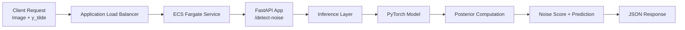
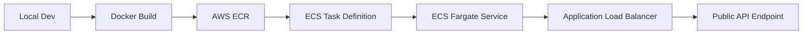
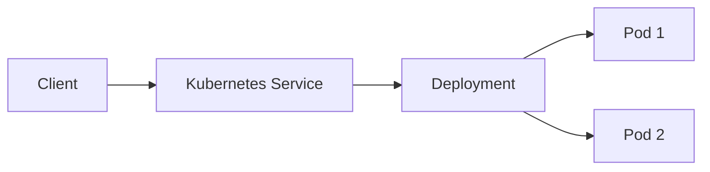
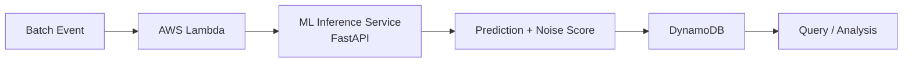

#  Production ML System for Label Noise Detection

A production-ready machine learning system for detecting noisy labels in image datasets.

Built with **PyTorch**, **FastAPI**, **Docker**, deployed on **AWS ECS (Fargate)** and **Kubernetes**, and extended with an **event-driven async pipeline (Lambda + DynamoDB)**.

---

#  Live API

```text
http://noise-detector-task-balancer-102795637.us-east-1.elb.amazonaws.com
```

---

##  Health Check

```bash
GET /health
```

```json
{"status": "ok"}
```

---

##  Noise Detection API

```bash
POST /detect-noise
```

### Example

```bash
curl -X POST "http://noise-detector-task-balancer-102795637.us-east-1.elb.amazonaws.com/detect-noise" \
  -F "file=@test.jpg" \
  -F "y_tilde=3"
```

### Response

```json
{
  "noise_score": 0.9979,
  "prob_observed_label": 0.0020,
  "observed_label": 3,
  "observed_label_name": "cat",
  "predicted_label": 1,
  "predicted_label_name": "automobile",
  "posterior": [...]
}
```

---

#  System Architecture

##  High-Level Architecture



---

##  Deployment Pipeline



---

##  Kubernetes Deployment



Features:

* Replica-based scaling
* Built-in load balancing
* Liveness & readiness probes
* Self-healing pods

---

##  Async Data Processing Pipeline



---

#  Core Capabilities

* Real-time ML inference via REST API
* Scalable containerized deployment (Docker)
* Cloud deployment on AWS ECS (Fargate)
* Kubernetes orchestration (replicas, health checks, load balancing)
* Event-driven async pipeline (Lambda + DynamoDB)
* Dataset quality analysis via noise scoring

---

#  Tech Stack

* **Machine Learning**: PyTorch, Variational Inference (ELBO)
* **Backend**: FastAPI
* **Containerization**: Docker
* **Cloud Infrastructure**: AWS ECS (Fargate), ECR, ALB
* **Orchestration**: Kubernetes (Deployment, Service)
* **Async Processing**: AWS Lambda, DynamoDB
* **Data Processing**: NumPy, PIL, Torchvision

---

#  Local Development

## 1️ Install dependencies

```bash
pip install -r requirements.txt
```

## 2️ Run server

```bash
uvicorn app:app --reload
```

## 3️ Test locally

```bash
curl -X POST "http://127.0.0.1:8000/detect-noise" \
  -F "file=@test.jpg" \
  -F "y_tilde=3"
```

---

#  Docker

## Build

```bash
docker build -t noise-detector .
```

## Run

```bash
docker run -p 8000:8000 noise-detector
```

---

#  Kubernetes

## Deploy

```bash
kubectl apply -f k8s/deployment.yaml
kubectl apply -f k8s/service.yaml
```

## Check

```bash
kubectl get pods
kubectl get svc
```

## Port Forward

```bash
kubectl port-forward service/noise-detector-service 8000:80
```

---

#  AWS Deployment

Pipeline:

```text
Docker → ECR → ECS Fargate → ALB → Public API
```

Key steps:

* Containerized ML inference service
* Pushed images to AWS ECR
* Deployed ECS Fargate service
* Configured Application Load Balancer
* Exposed public API endpoint

---

#  Async Pipeline (Lambda + DynamoDB)

## Use Case

For large datasets:

* Trigger batch job
* Lambda processes asynchronously
* Calls `/detect-noise`
* Stores results in DynamoDB

---

## Example Event

```json
{
  "job_id": "job-001",
  "samples": [
    {
      "sample_id": "img-0001",
      "image_url": "https://example.com/test.jpg",
      "y_tilde": 3
    }
  ]
}
```

---

## Example Record (DynamoDB)

```json
{
  "job_id": "job-001",
  "sample_id": "img-0001",
  "noise_score": 0.9979,
  "predicted_label_name": "automobile"
}
```

---

#  Testing Async Pipeline (Local Simulation)

```bash
cd async_pipeline
python test_lambda_local.py
```

This simulates:

* batch event
* API calls
* result generation

---

#  Engineering Challenges & Solutions

### 1. Docker Cache Issues

* Fixed with `--no-cache` rebuilds

### 2. Missing Dependency (NumPy)

* Debugged via logs and fixed runtime environment

### 3. ECS Deployment Errors

* Resolved IAM and service role issues

### 4. Container Resource Limits

* Fixed storage/memory issues

### 5. Networking Issues

* Configured security groups and ports

### 6. Kubernetes Health Checks

* Implemented readiness & liveness probes

---

#  Key Features

* Probabilistic label noise detection
* Posterior-based confidence estimation
* Human-readable class labels
* Real-time + async processing support
* Production deployment (AWS + Kubernetes)

---

#  Project Highlights

* Transformed research ML model into production system
* Built full inference pipeline
* Designed both real-time and async workflows
* Deployed on AWS and Kubernetes
* Implemented event-driven data pipeline
* Debugged real-world production issues

---

#  Project Structure

```text
AWS_noisy_label_detection/
│
├── app.py
├── inference.py
├── model.py
├── requirements.txt
├── Dockerfile
├── README.md
│
├── async_pipeline/
│   ├── lambda_handler.py
│   ├── batch_request_example.json
│   └── dynamodb_schema.md
│
├── k8s/
│   ├── deployment.yaml
│   └── service.yaml
│
├── checkpoints/
│   └── model.pt
│
└── data/
    └── test.jpg
```

---

#  Demo

### API Response


---

#  Author

Built as part of a transition from research ML to production AI systems, focusing on:

* ML system design
* backend engineering
* cloud deployment
* scalable inference systems
