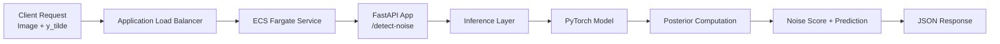
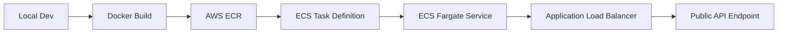
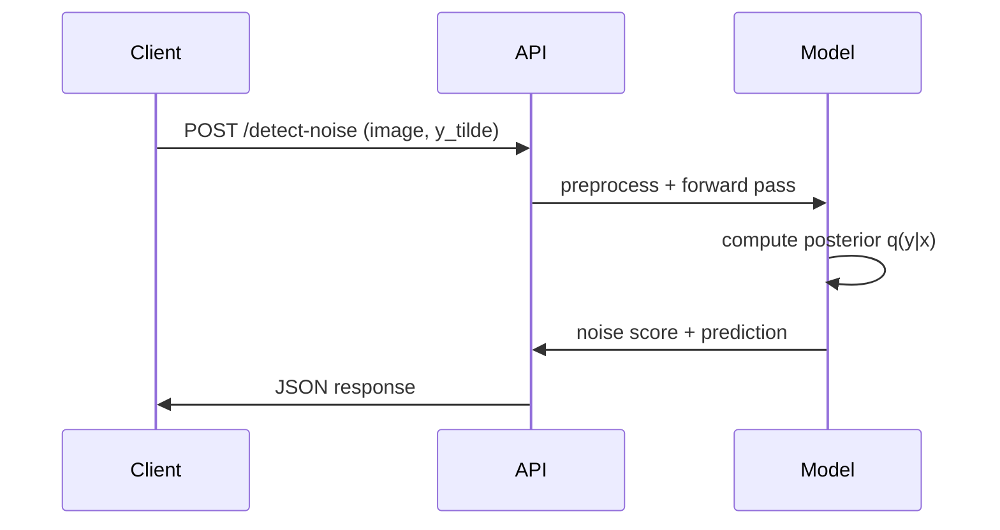

# 🧠 Production ML Service for Label Noise Detection

A production-ready machine learning system for detecting noisy labels in image datasets.
Built with PyTorch, FastAPI, Docker, and deployed on AWS ECS with a public API endpoint.

---

## 🚀 Live API

```text
http://noise-detector-task-balancer-102795637.us-east-1.elb.amazonaws.com
```

---

### 🔹 Health Check

```bash
GET /health
```

```json
{"status": "ok"}
```

---

### 🔹 Noise Detection API

```bash
POST /detect-noise
```

#### Example

```bash
curl -X POST "http://noise-detector-task-balancer-102795637.us-east-1.elb.amazonaws.com/detect-noise" \
  -F "file=@test.jpg" \
  -F "y_tilde=3"
```

#### Response

```json
{
  "noise_score": 0.9979,
  "prob_observed_label": 0.0020,
  "observed_label": 3,
  "observed_label_name": "cat",
  "predicted_label": 1,
  "predicted_label_name": "automobile",
  "posterior": [...]
}
```

---

# 🧩 System Architecture

## 🔷 High-Level Architecture



---

## 🔷 Deployment Pipeline



---

## 🔷 Inference Flow



---

# 🏗️ Tech Stack

* **Machine Learning**: PyTorch, Variational Inference (ELBO)
* **Backend**: FastAPI
* **Containerization**: Docker
* **Cloud Infrastructure**: AWS ECS (Fargate), ECR, ALB
* **Data Processing**: NumPy, PIL, Torchvision

---

# ⚙️ Local Development

## 1️⃣ Install dependencies

```bash
pip install -r requirements.txt
```

## 2️⃣ Run server

```bash
uvicorn app:app --reload
```

## 3️⃣ Test locally

```bash
curl -X POST "http://127.0.0.1:8000/detect-noise" \
  -F "file=@test.jpg" \
  -F "y_tilde=3"
```

---

# 🐳 Docker

## Build

```bash
docker build -t noise-detector .
```

## Run

```bash
docker run -p 8000:8000 noise-detector
```

---

# ☁️ AWS Deployment

## Pipeline

```text
Docker → ECR → ECS Fargate → ALB → Public API
```

## Key Steps

* Containerized ML inference service
* Pushed versioned images to AWS ECR
* Deployed scalable service on ECS Fargate
* Configured Application Load Balancer + target group
* Enabled public HTTP endpoint

---

# 🛠️ Engineering Challenges & Solutions

### 1. Docker Cache Issues

* Problem: New dependencies not reflected in container
* Solution: Forced rebuild (`--no-cache`) and used versioned image tags

### 2. Missing Runtime Dependency

* Problem: `RuntimeError: Numpy is not available`
* Solution: Debugged via CloudWatch logs and fixed dependency management

### 3. ECS Deployment Failures

* Problem: IAM & service-linked role errors
* Solution: Fixed IAM permissions and ECS roles

### 4. Container Resource Limits

* Problem: `no space left on device`
* Solution: Optimized image size and resource allocation

### 5. Networking Issues

* Problem: API unreachable
* Solution: Configured security groups and port mappings (8000)

### 6. ALB Routing

* Problem: Requests not reaching container
* Solution: Fixed target group health check + routing

---

# 📌 Key Features

* Probabilistic label noise detection
* Posterior-based confidence estimation
* Human-readable class labels
* Fully deployed ML system (not just notebook)
* Public API accessible via HTTP

---

# 🎯 Project Highlights

* Transformed research ML model into production system
* Designed full inference pipeline
* Built RESTful ML API
* Deployed scalable cloud service on AWS
* Debugged real-world production issues

---

# 📁 Project Structure

```text
AWS_noisy_label_detection/
│
├── app.py
├── inference.py
├── model.py
├── requirements.txt
├── Dockerfile
├── README.md
│
├── checkpoints/
│   └── model.pt
│
└── data/
    └── test.jpg
```

---

## 📷 Demo

### 🔹 API Call

```bash
curl -X POST "http://127.0.0.1:8000/detect-noise" \
  -F "file=@test.jpg" \
  -F "y_tilde=3"
```

---

### 🔹 Response

```json
{
  "noise_score": 0.9979,
  "prob_observed_label": 0.0021,
  "observed_label_name": "cat",
  "predicted_label_name": "automobile"
}
```

---

### 🔹 Interpretation

* The observed label (`cat`) is likely **incorrect**
* The model predicts `automobile` with high confidence
* Noise score ≈ **1.0 → highly suspicious label**

---

### 🔹 Suspicious Samples


# 🧠 Author

Built as part of a transition from research ML to production AI systems, focusing on real-world deployment and reliability.

---
